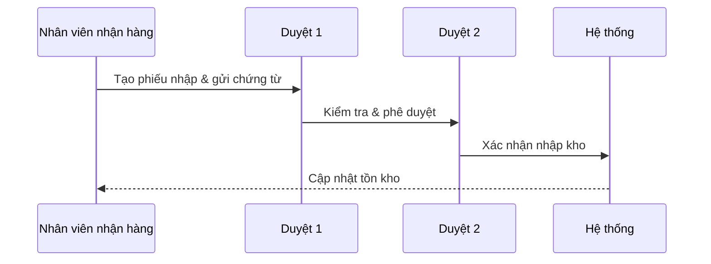
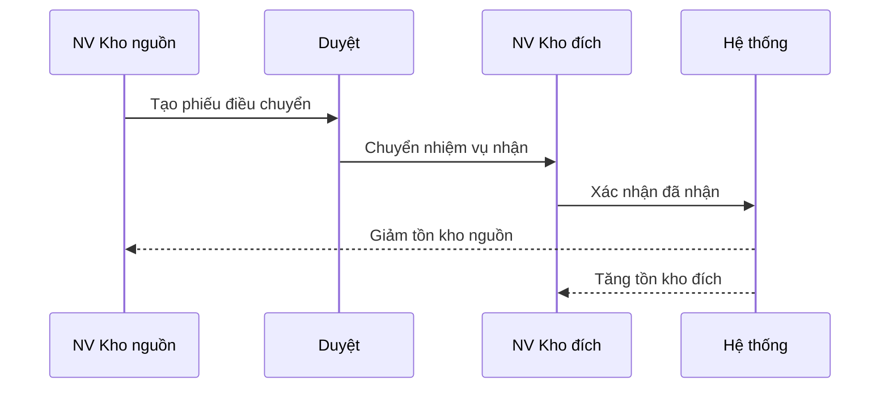
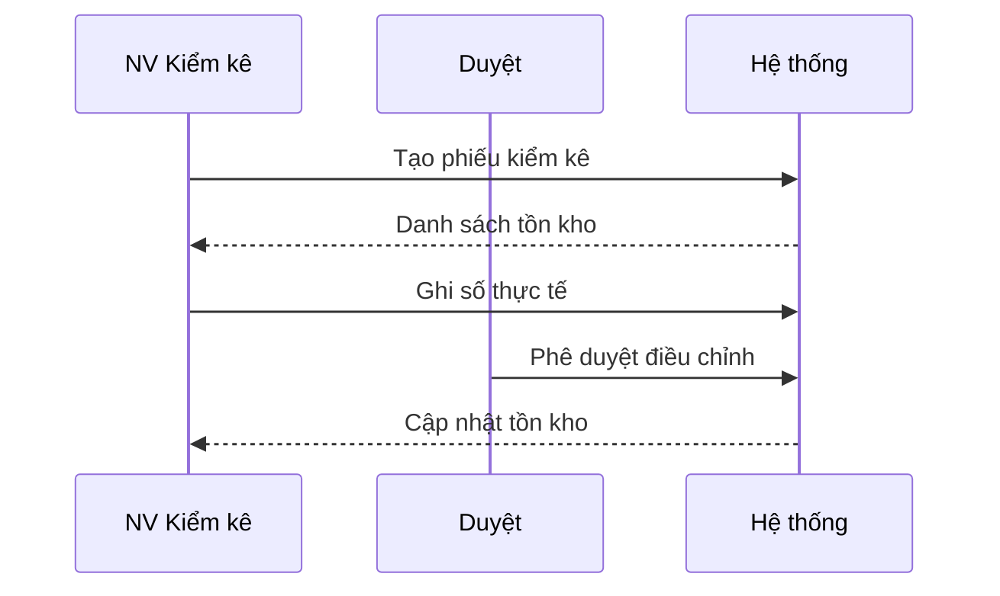
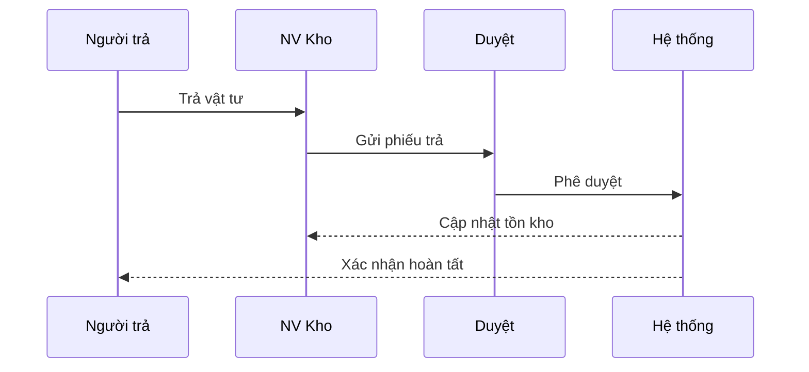
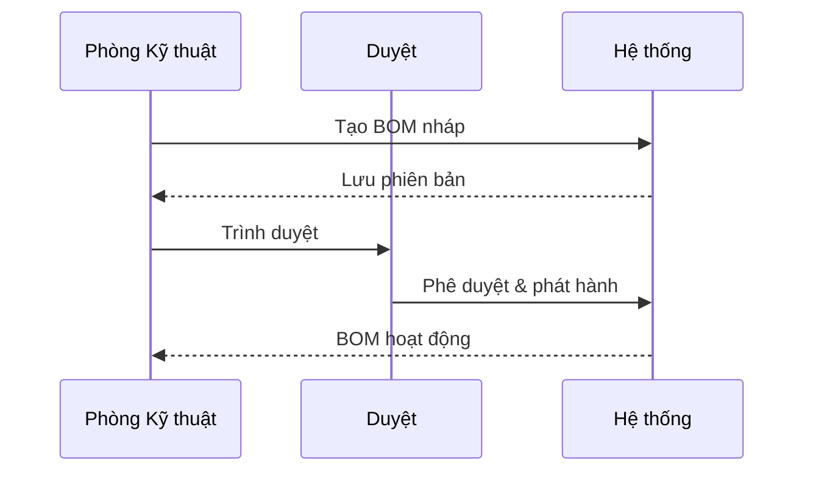
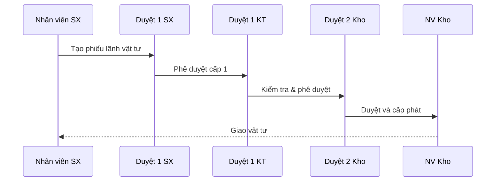
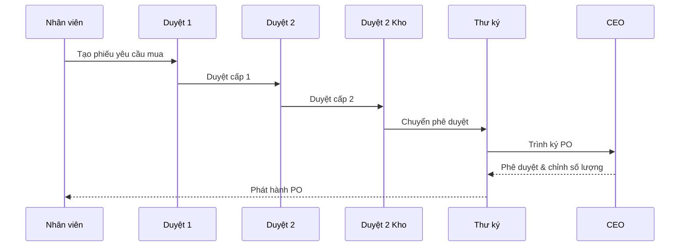

# DEMAX Inventory SRS Summary

## 0. Thông tin kiểm soát tài liệu
### 0.1 Lịch sử thay đổi
- **1.0 Draft** – 2025-08-09 – ChatGPT: tái cấu trúc SRS theo chuẩn IEEE 29148, bổ sung mục còn thiếu và chuẩn hoá tiêu đề.

### 0.2 Phân phối tài liệu
- CEO DEMAX
- Trưởng bộ phận Kho
- Trưởng bộ phận Sản xuất
- Trưởng bộ phận Kỹ thuật
- Bộ phận Thu mua
- Đội triển khai phần mềm

### 0.3 Thuật ngữ & viết tắt
BOM (Bill of Materials), Min/Max, GRN (Goods Receipt Note), SKU, UoM, Lot/Batch, Serial, SLA, SoD, RBAC.

### 0.4 Tài liệu tham chiếu
- SRS Kho DEMAX -Draft.docx (bản gốc người dùng cung cấp)
- IEEE 29148:2018 – Requirements engineering
- ISO/IEC 25010:2011 – Software quality models

## 1. Giới thiệu
### 1.1 Mục tiêu tài liệu
Định nghĩa phạm vi, yêu cầu chức năng và phi chức năng cho hệ thống Quản lý Kho DEMAX làm cơ sở thiết kế, phát triển, kiểm thử và nghiệm thu.

### 1.2 Phạm vi hệ thống
Quản lý tồn kho, nhập/xuất, lãnh vật tư theo BOM, kiểm kê, thu mua, cảnh báo Min–Max, báo cáo và truy vết lô/serial. Giai đoạn đầu tập trung web, mobile quét mã sẽ xem xét sau.

### 1.3 Đối tượng & cách sử dụng
Ban điều hành, Kho, Kỹ thuật, Sản xuất, Thu mua và Đội triển khai dùng làm nguồn tham chiếu thống nhất giữa nghiệp vụ và kỹ thuật.

### 1.4 Giả định & ràng buộc
- Danh mục vật tư/kho/nhà cung cấp được chuẩn hoá trước go-live.
- Có thiết bị quét barcode/QR cho nghiệp vụ.
- Số chứng từ đánh số duy nhất theo ngày/kho.
- Tích hợp kế toán/ERP thực hiện giai đoạn sau.

### 1.5 Ngoài phạm vi
Không bao gồm Bán hàng/CRM, kế toán tài chính và các chức năng QA chuyên sâu.

## 2. Tổng quan & kiến trúc
### 2.1 Bối cảnh nghiệp vụ
DEMAX vận hành nhiều kho: kho chung vật tư, kho thành phẩm, kho phân xưởng với nghiệp vụ nhập, cấp phát theo BOM/kho chung, kiểm kê, điều chuyển và thu mua theo thiếu hụt.

### 2.2 Kiến trúc hệ thống
- Ứng dụng Web SPA + API
- CSDL quan hệ (PostgreSQL/MySQL)
- Lưu trữ chứng từ/ảnh: object storage
- In tem/nhãn: máy in hỗ trợ ZPL/TSPL

### 2.3 Tích hợp
Barcode/QR, Email/SMS/Chat cho thông báo và cảnh báo, ERP/kế toán trao đổi PO/GRN/Issue (tương lai).

## 3. Yêu cầu UI/UX
- Giao diện web thân thiện, thao tác nhanh với phím tắt
- Hỗ trợ quét barcode/QR ở mọi form
- Dashboard theo dõi tiến trình phiếu
- In phiếu nhập/xuất/lãnh và tem nhãn

## 4. Yêu cầu dữ liệu & mã hoá
### 4.1 Danh mục chính
Kho, Khu/Bin, Vật tư (SKU), ĐVT (UoM), Nhóm vật tư, Nhà cung cấp, BOM, Người dùng & Vai trò.

### 4.2 Thực thể giao dịch
Phiếu Nhập (GRN), Phiếu Xuất/Issue, Phiếu Lãnh, Điều chuyển, Kiểm kê, Yêu cầu mua (PR), Đơn mua (PO).

### 4.3 Quy tắc mã & chứng từ
Chứng từ: PREFIX-YYYYMMDD-SEQ. SKU duy nhất; lô/serial nếu áp dụng; số lượng theo ĐVT chuẩn với quy đổi.

## 5. Yêu cầu chức năng & quy trình
### 5.1 Quản lý kho & nhập/xuất
- Nhập kho: tạo phiếu, quét mã, đính kèm ảnh/chứng từ, duyệt 2 cấp, cập nhật tồn.
- Xuất kho: theo phiếu lãnh/đơn nội bộ, duyệt và cập nhật tồn.
- Điều chuyển nội bộ, trả hàng, kiểm kê và điều chỉnh chênh lệch.

#### Điều chuyển nội bộ

#### Kiểm kê & điều chỉnh

#### Trả hàng

### 5.2 Quản lý BOM
- Tạo/sửa BOM, phiên bản hoá, quyền chỉnh sửa theo vai trò.
- Thêm vật tư mới khi chưa có trong danh mục qua quy trình đề xuất & duyệt.
- Phân loại kho theo BOM hoặc Min–Max; tồn < Min tự động gửi yêu cầu mua để duyệt.
- AC: không xoá BOM đang được tham chiếu; ghi lại lịch sử thay đổi.

### 5.3 Lãnh vật tư theo BOM/kho chung
- Tạo phiếu lãnh theo BOM hoặc kho chung.
- Hệ thống xác định kho liên quan và giao nhiệm vụ cấp phát.
- Nhân viên kho chỉ cập nhật dòng vật tư thuộc kho mình.
- Cập nhật số lượng thực cấp phát, chụp bằng chứng, theo dõi trạng thái.
- AC: audit log cho từng phát sinh; cảnh báo khi tồn < Min hoặc thiếu so với BOM.

### 5.4 Thu mua
- Xác định thiếu hụt theo BOM & tồn hiện tại để tạo PR/PO.
- Quy trình duyệt: Nhân viên → Duyệt 1 → Duyệt 2 → Kho → Thư ký → CEO (có thể điều chỉnh số lượng).
- AC: không phát hành PO khi PR chưa duyệt đủ; theo dõi giao hàng và khớp nhập kho.

### 5.5 Báo cáo
Nhập–Xuất–Tồn theo thời gian/kho/SKU, thiếu hụt theo BOM, tuổi tồn, truy vết lô/serial.

## 6. Phân quyền, bảo mật & yêu cầu phi chức năng
### 6.1 Phân quyền
Vai trò: Kho, Kỹ thuật, Sản xuất, Thu mua, Duyệt 1, Duyệt 2, Thư ký, CEO, Admin.
Quy tắc SoD: người tạo không được tự duyệt; xuất kho cần người khác xác nhận.

### 6.2 Hiệu năng
- Thời gian phản hồi < 1s cho thao tác quét.
- Báo cáo lớn xử lý nền và tải về khi hoàn tất.

### 6.3 Sẵn sàng & sao lưu
Uptime mục tiêu 99.5%; snapshot DB hàng ngày; RTO < 4h; RPO < 24h.

### 6.4 Nhật ký & truy vết
Ghi log thay đổi dữ liệu quan trọng; lưu ảnh chứng từ tối thiểu 12 tháng.

### 6.5 Ma trận quyền (Role × Use case)
Bảng giản lược quyền thao tác theo vai trò; ✓ = được phép.

| Quy trình | Kho | SX-KT | Thu mua | Duyệt | CEO | Admin |
|---|---|---|---|---|---|---|
| Nhập kho (GRN) | ✓ |  | ✓ | ✓ | ✓ | ✓ |
| Xuất/Lãnh | ✓ | ✓ |  | ✓ |  | ✓ |
| Điều chuyển | ✓ |  |  | ✓ |  | ✓ |
| Kiểm kê | ✓ |  |  | ✓ |  | ✓ |
| PR/PO | ✓ |  | ✓ | ✓ | ✓ | ✓ |
| Báo cáo | ✓ | ✓ | ✓ | ✓ | ✓ | ✓ |

### 6.6 Ma trận RACI
| Quy trình / Vai trò | Kho | SX-KT | Thu mua | Duyệt | CEO | Admin |
|---|---|---|---|---|---|---|
| Nhập kho | R | C | A | I | I | |
| Xuất kho | C | R |  | A | I | |
| Điều chuyển | R | A |  |  | I | |
| Kiểm kê | R |  |  | A | I | C |
| Lãnh vật tư | C | R |  | A | I | |
| Quản lý BOM | R | A |  |  | C | |
| PR (Tạo/Duyệt) | R | C | C | A | I | |
| PO (Tạo/Duyệt) | R | C | A |  | I | |
| Báo cáo | R | R | R | A | C | |

## 7. Vận hành & cấu hình
Cấu hình Min/Max theo SKU-kho, quy tắc đánh số chứng từ, mẫu in, phân quyền duyệt. Danh mục chuẩn hoá và import CSV ban đầu.

## 8. Nghiệm thu (UAT) & kiểm thử
Checklist UAT cho từng quy trình (nhập, xuất, lãnh, mua, kiểm kê), dữ liệu mẫu và tiêu chí Pass/Fail, kịch bản lỗi thường gặp.

## 9. Rủi ro & biện pháp
- Quét nhầm mã → xác nhận hai bước & cảnh báo màu.
- Chênh lệch kiểm kê → đối soát định kỳ và yêu cầu ảnh bằng chứng.
- Tồn âm do đồng bộ chậm → khoá giao dịch tạm thời và xử lý hàng đợi.

